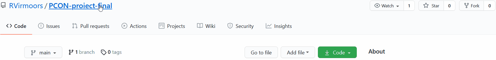
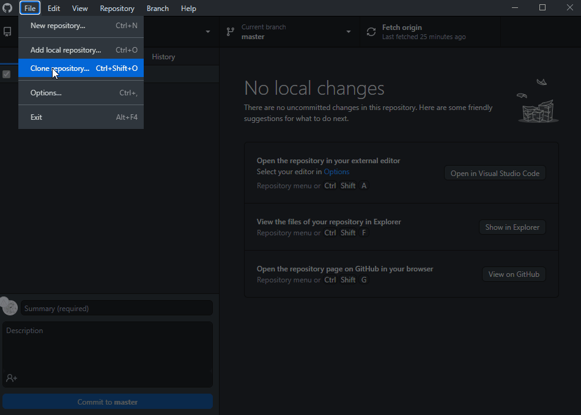
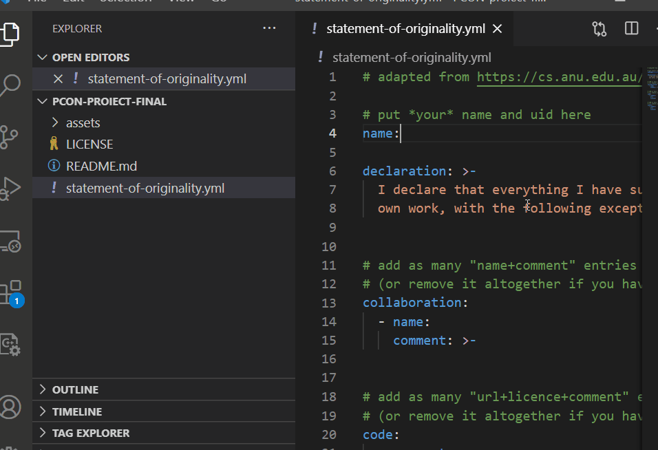

# (Titlu)
(Scurtă descriere)

## (Instalare)
...

## (Utilizare)
...

## (Istoric)

(13.05) ...

(3.06) ...

(X.06) ...

## (Link-uri)
...

# Dezvoltarea proiectului

Procesul este următorul (inspirat de [aici](https://cs.anu.edu.au/courses/comp1720/deliverables/05-major-project/#submission-process))

1. *fork* al acestui template către propriul tău cont de Github

2. *clone* al repo-ului din contul tău pentru a-l downloada local

3. *commit* și *push* pe măsură ce lucrezi la proiect. Ultima versiune push-ată pe server înainte de deadline va conta pentru evaluare.

## Elemente obligatorii

1. Acest readme completat. Titlu, descriere, mod de utilizare, istoric, link-uri utile.

   Poți include și imagini și chiar [gif-uri animate](https://www.screentogif.com/), sau link-uri către materiale audio/video.
   
   Vezi [aici](https://charlesmartin.com.au/blog/2020/08/09/student-project-repository) mai multe sugestii.

2. [Declarația de originalitate](statement-of-originality.yml) completată. Tot ce nu este inclus acolo va fi considerat 100% contribuție proprie.

    *(formatul este adaptat de [aici](https://gitlab.cecs.anu.edu.au/comp1720/2018/comp1720-2018-major-project/-/blob/master/statement-of-originality.yml). Da, este un pic ironic să refolosim un doc [de altundeva](https://cs.anu.edu.au/courses/comp1720/resources/faq/#how-do-i-fill-out-my-statement-of-originality), dar menționăm sursa deci nu este plagiat!)*

3. Proiectul în sine. Tot codul trebuie să fie prezent, proiectul trebuie să poată rula conform instrucțiunilor din readme. Dacă e nevoie de asset-uri mari (sunete, video etc), include link de download în instrucțiunile de instalare.

